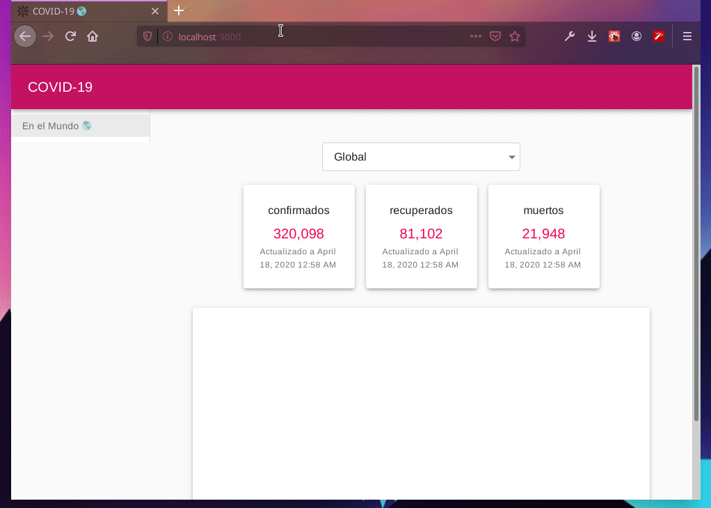

<h1 align="center">COVID-19</h1>

  <em>
    COVID-19 cases 🌎 
  </em>
   
  

![Stability Project][stability-image]

## 📈 DataSource COVID19-api

| API               |                                                           Fuente |
| :---------------- | ---------------------------------------------------------------: |
| **Mundial**       |           [mathdroid](https://github.com/mathdroid/covid-19-api) |
| **Latinoamerica** | 🔎 |

## CONTRIBUTORS ✨

<table>
  <tr>
    <td align="center">
      <a href="https://github.com/wilderPariona">
       <b>
      Wilder Pariona
      </b></a>
       
      <a href="https://github.com/wilderPariona/devVideos/commits?author=wilderPariona" title="Code">
      💻
      </a> 
      <a href="#design-wilderPariona" title="Design">
      🎨
      </a> 
      <a href="https://github.com/wilderPariona/devVideos/commits?author=wilderPariona" title="Documentation">
      📖
      </a> 
      <a href="#infra-wilderPariona" title="Infrastructure (Hosting, Build-Tools, etc)">
      🛠️
      </a> 
      <a href="#maintenance-wilderPariona" title="Maintenance">
      🚧
      </a> 
    </td>
  </tr>
</table>

## LICENSE

[MIT ](LICENSE) [©️ widerPariona](http://github.com/wilderPariona)

[stability-image]: https://img.shields.io/badge/stability-work_in_progress-lightgrey.svg
